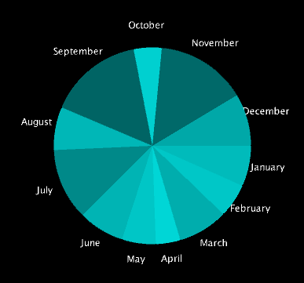

# Abstract Visual Story of a Song Team Project

Include for each contributer:

Name: Richard Lazarica

Student Number: C22739341
 
Class Group: B

Github: https://github.com/RichardLazarica/Assignment

# Video

[](https://www.youtube.com/watch?v=J2kHSSFA4NU)

# Screenshots

# Description of the project

# Instructions for use

# How it works:
The user chooses between various visualisations by pressing keyboards keys between 0 - 9

# List of classes/assets in the project

| Class/asset | Source |
|-----------|-----------|
| Assignment.java | Self written |


# References
* Item 1
* Item 2

# What I am most proud of in the assignment

Richard Lazarica: I am proud that I was able to create a music visualiser even though I'm not good at handling problems or projects that have or represents something graphical.

# What I learned

Richard Lazarica: I have learned about OOP and how to use them adequately with graphic library in order to represent frequencies visually. It helped refine my knowledge I previously had about OOP principles and learned how to create graphical animated objects from scratch.

# Proposal submitted earlier can go here (if there is one):

## Below is how to use Markdown. You can delete this:

## This is how to markdown text:

This is *emphasis*

This is a bulleted list

- Item
- Item

This is a numbered list

1. Item
1. Item

This is a [hyperlink](http://bryanduggan.org)

# Headings
## Headings
#### Headings
##### Headings

This is code:

```Java
public void render()
{
	ui.noFill();
	ui.stroke(255);
	ui.rect(x, y, width, height);
	ui.textAlign(PApplet.CENTER, PApplet.CENTER);
	ui.text(text, x + width * 0.5f, y + height * 0.5f);
}
```

So is this without specifying the language:

```
public void render()
{
	ui.noFill();
	ui.stroke(255);
	ui.rect(x, y, width, height);
	ui.textAlign(PApplet.CENTER, PApplet.CENTER);
	ui.text(text, x + width * 0.5f, y + height * 0.5f);
}
```

This is an image using a relative URL:



This is an image using an absolute URL:


This is a youtube video:

[](https://www.youtube.com/watch?v=J2kHSSFA4NU)

This is a table:

| Heading 1 | Heading 2 |
|-----------|-----------|
|Some stuff | Some more stuff in this column |
|Some stuff | Some more stuff in this column |
|Some stuff | Some more stuff in this column |
|Some stuff | Some more stuff in this column |

